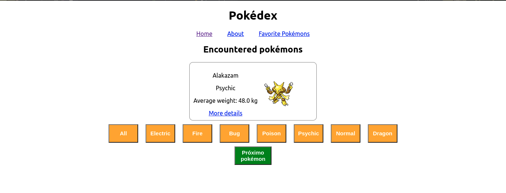

# Sobre o Projeto:

Página em react que consome a [PokéAPI](https://pokeapi.co/) que apresenta alguns pokémons do universo de pokémon e apresenta seus detalhes, também é possível favoritar pokémons.

# Instruções para rodar o projeto localmente e os testes:

1. Instale as dependências
  * `npm install`
  
2. Rode o Projeto Testado
  * `npm start`

3. Para Rodar um teste específico
  * `npm test {nome do teste}`
    * exemplo `npm test about`
  * Lista com todos os testes:
    * `about`
    * `app`
    * `favoritepokemons`
    * `notfound`
    * `pokedex`
    * `pokemon`
  
4. Para rodar todos testes e calcular a média de aprovação
  * `npm run test-coverage`
